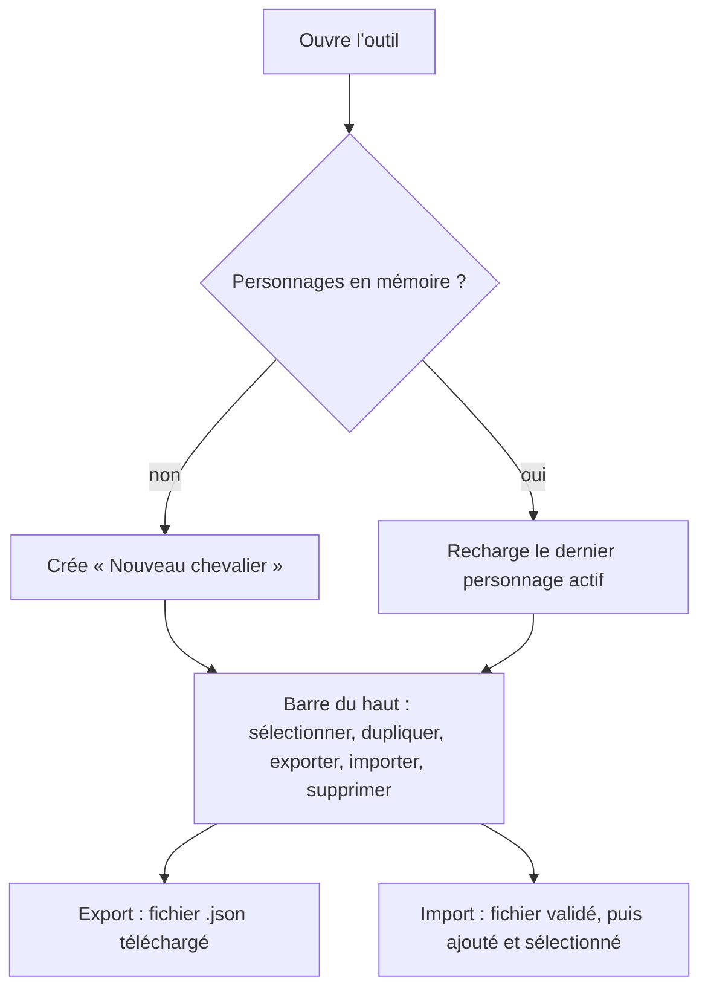
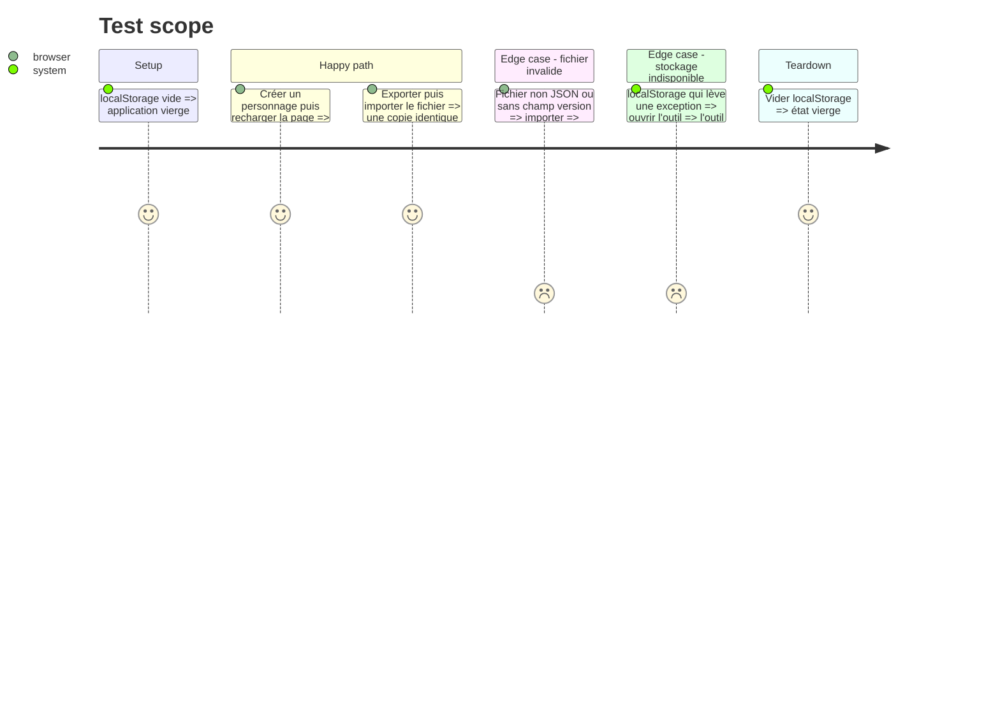

# Instruction: Socle — projet, persistance, gestion des personnages, import et export

## Architecture projection

> Tree of the final files. ✅ create · ✏️ modify · ❌ delete

```txt
.
├── ✅ package.json                 # Vite, Vue 3, TS, Pinia, Vitest, @vue/test-utils, jsdom, vite-plugin-singlefile
├── ✅ vite.config.ts               # plugin vue + singlefile, config Vitest (jsdom)
├── ✅ tsconfig.json                # strict
├── ✅ index.html
├── ✅ .gitignore                   # node_modules, dist
├── ✅ README.md                    # lancer (dev, build), ouvrir dist/index.html
└── src
    ├── ✅ main.ts                  # création de l'app et de Pinia
    ├── ✅ App.vue                  # coquille : barre du haut, zone fiche, zone actions
    ├── ✅ styles/base.css          # thème sombre, grille PC (fiche à gauche, actions à droite)
    ├── rules
    │   └── ✅ types.ts             # types Character (squelette), CharacterFile (version), RulesConfig (squelette)
    ├── ✅ config/defaultRules.ts   # RulesConfig par défaut (rempli au fil des phases)
    ├── stores
    │   ├── ✅ characters.ts        # liste, personnage actif, créer, dupliquer, supprimer, renommer
    │   └── ✅ persistence.ts       # chargement et sauvegarde localStorage (clé versionnée, try/catch), migration
    ├── services
    │   └── ✅ fileIO.ts            # export d'un personnage en .json, import avec validation et normalisation
    └── components
        └── ✅ TopBar.vue           # sélecteur de personnage, Nouveau, Dupliquer, Exporter, Importer, Supprimer (avec confirmation)
└── tests
    ├── ✅ persistence.spec.ts
    └── ✅ fileIO.spec.ts
```

## User Journey



## Test Scope



## Wireframe

```txt
┌──────────────────────────────────────────────────────────────────────────────┐
│ (1) KnightPlay · [Personnage ▼] Nouveau Dupliquer Exporter Importer Suppr.  │
├──────────────────────────────────────────────────────────────────────────────┤
│ (2) Jauges : Santé ▮▮▮▯ · Armure ▮▮▯ · Énergie ▮▮▮ · Espoir ▮▮▮▮ · Héroïsme ●●○│
├───────────────────────────────────────────────┬──────────────────────────────┤
│ (3) Fiche (onglets)                            │ (4) Actions                  │
│  [Identité & Aspects][Méta-armure][Armes]      │  Test · Attaque · Encaisser  │
│  [Modules][Progression][Notes]                 │  Modules/Énergie             │
│                                                │ (5) Journal des jets         │
└───────────────────────────────────────────────┴──────────────────────────────┘
```

1. Barre du haut : gestion des personnages (cette phase).
2. Jauges toujours visibles (phase 2).
3. Fiche à onglets (phases 2, 4, 5, 7).
4. Panneau d'actions en partie (phases 3 à 6).
5. Journal des jets et actions (phase 3).

## Tasks to do

### `1)` Initialiser le projet

> Avoir un projet Vite, Vue 3 et TypeScript qui démarre, se teste et se construit en un seul fichier.

1. Créer le projet `vue-ts`, puis ajouter Pinia, Vitest, `@vue/test-utils`, `jsdom` et `vite-plugin-singlefile`.
2. Scripts `dev`, `build`, `test`, `typecheck`. TypeScript strict.
3. `git init` avec une branche principale. Ajouter `.gitignore` et un README de lancement.

### `2)` Modèle et persistance

> Charger et sauvegarder les personnages de façon fiable et versionnée.

1. Définir `CharacterFile { version, character }` et le squelette `Character` (id, nom, dates).
2. `persistence.ts` : clé `knightplay.v1`. Sauvegarde automatique (`watch` profond, avec debounce). Toute lecture ou écriture dans un `try/catch`, avec repli en mémoire et un avertissement.
3. Fonction `normalizeCharacter` : complète les champs manquants (compatibilité ascendante).
4. Convention posée dès maintenant : toute fonction de `src/rules/` reçoit `RulesConfig` en paramètre et n'importe jamais `defaultRules` directement. Le store `rules` de la phase 8 n'aura qu'à fournir la config effective.

### `3)` Gestion des personnages et fichiers

> Créer, dupliquer, supprimer, sélectionner, exporter et importer.

1. Store `characters` : actions CRUD et `activeId` persistés.
2. `fileIO.ts` : export en `<nom>.knightplay.json`. Import validé (version, structure) et normalisé, avec un nouvel id en cas de doublon.
3. `TopBar.vue` : ces commandes, avec une confirmation avant suppression.

### `4)` Coquille de l'interface

> Avoir la disposition PC prête à recevoir les phases suivantes.

1. `App.vue` et `base.css` : barre, jauges (vides), fiche à onglets (vides), panneau d'actions (vide), journal (vide).

## Test acceptance criteria

| Task | Acceptance criteria |
| ---- | ------------------- |
| 1 | `npm run dev` affiche l'application. `npm run build` produit un `dist/index.html` unique qui s'ouvre par double-clic. `npm test` passe. |
| 2 | Après rechargement, les personnages et le personnage actif sont restaurés. Si le stockage est indisponible, l'outil reste utilisable et affiche un avertissement. |
| 3 | Un personnage exporté puis réimporté est identique (hors id). Un fichier invalide est refusé avec un message, sans perte de données. La suppression demande une confirmation. |
| 4 | Les quatre zones (barre, jauges, fiche, actions avec journal) sont visibles sur un écran PC de 1366 px de large ou plus, sans défilement horizontal. |
