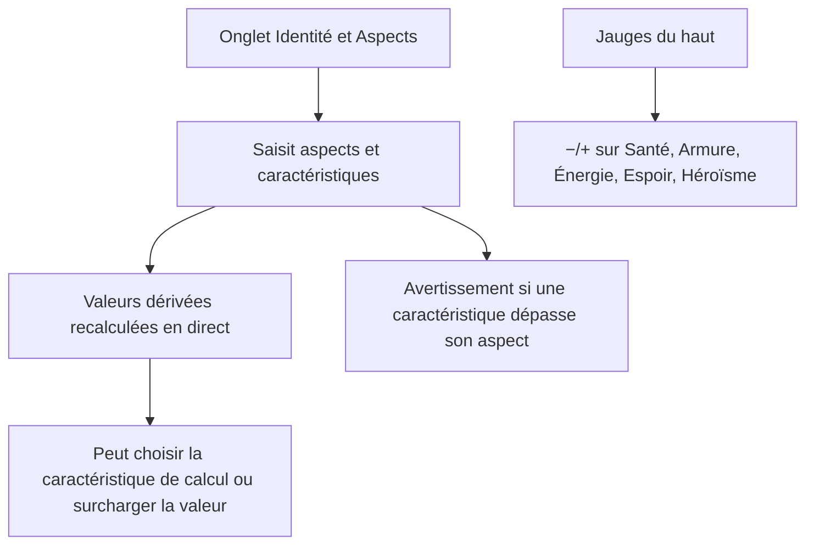
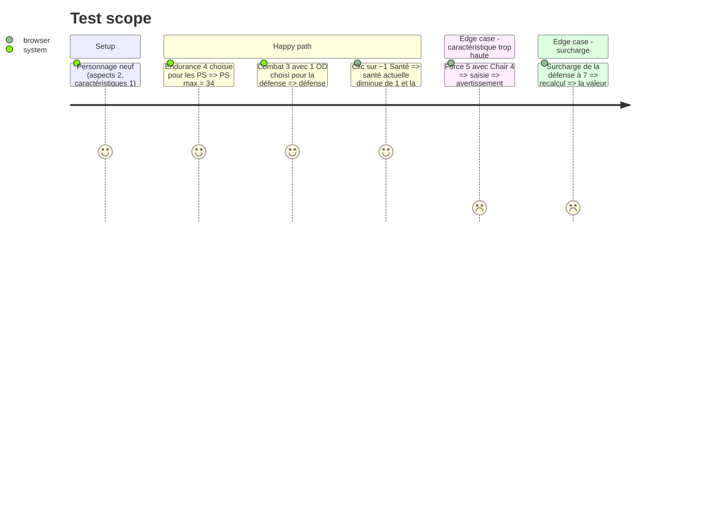

# Instruction: Fiche personnage — identité, aspects et caractéristiques, valeurs dérivées, jauges

## Architecture projection

> Tree of the final files. ✅ create · ✏️ modify · ❌ delete

```txt
.
└── src
    ├── rules
    │   ├── ✏️ types.ts              # Character complet : identité, aspects, caractéristiques {val, odArmure}, jauges {actuel, total}, choix des caractéristiques de calcul, surcharges
    │   ├── ✅ derived.ts            # défense, réaction, initiative, PS max, contacts max, espoir max ; avertissements (caractéristique > aspect, aspect > 9)
    │   └── ✅ catalog.ts            # ASPECTS, CARACS (5 × 3), libellés
    ├── data
    │   └── ✅ creation.ts           # archétypes, lames du tarot (avantages et inconvénients), hauts faits, blasons et vœux, sections (fiche 02)
    ├── ✏️ config/defaultRules.ts    # formules : PS = base 10 + 6 × caractéristique ; espoir de base 50 ; héroïsme max 6
    ├── components
    │   ├── ✅ GaugesBar.vue         # 5 jauges (Santé, Armure, Énergie, Espoir, Héroïsme) : −/+ et saisie directe, actuel ≤ total
    │   ├── sheet
    │   │   ├── ✅ IdentityPanel.vue # nom, surnom, archétype, haut fait, blason et vœu, section, motivations, avantages et inconvénients (listes préremplies et texte libre)
    │   │   ├── ✅ AspectsPanel.vue  # 5 aspects, 15 caractéristiques et OD ; clic sur une caractéristique = base du test (événement)
    │   │   └── ✅ DerivedPanel.vue  # valeurs dérivées calculées, choix de la caractéristique source, surcharge manuelle
    │   └── ✏️ App.vue
    └── stores
        └── ✏️ characters.ts         # actions de mise à jour (setCarac, setGauge…)
└── tests
    └── ✅ derived.spec.ts
```

## User Journey



## Test Scope



## Wireframe

```txt
┌───────────────────────────────────────────────┐
│ (1) Identité : Nom · Surnom · Archétype ▼     │
│     Haut fait ▼ · Blason ▼ (vœu) · Section ▼  │
├───────────────────────────────────────────────┤
│ (2) CHAIR [4]  BÊTE [3]  MACHINE [3] ...      │
│   Déplacement 3 OD1 │ Hargne 2 │ Tir 3 OD1 ...│
├───────────────────────────────────────────────┤
│ (3) Défense 4 (Combat ▼) · Réaction 4 (Tir ▼) │
│     Initiative 3 · PS 34 · Contacts 3 · Esp 50│
├───────────────────────────────────────────────┤
│ (4) Motivations · Avantages · Inconvénients   │
└───────────────────────────────────────────────┘
```

1. Identité, avec des listes préremplies issues du référentiel (fiche 02) et du texte libre.
2. Grille des aspects et caractéristiques, avec OD et avertissements.
3. Valeurs dérivées : source choisie, valeur calculée ou surchargée.
4. Motivations (1 majeure, mineures dont le vœu), avantages, inconvénients.

## Tasks to do

### `1)` Modèle et calculs dérivés

> Calculer les valeurs dérivées selon le référentiel (fiche 02, étape 9), en restant surchargeables.

1. Compléter `Character` (aspects, caractéristiques `{val, od}`, jauges, `derivedSource`, `overrides`).
2. `derived.ts` : défense, réaction et initiative = caractéristique choisie + ses OD. PS = 10 + 6 × caractéristique de Chair. Contacts = caractéristique de Dame. Espoir = 50 + modificateurs. Les constantes sont lues dans `RulesConfig`.
3. Validations non bloquantes : caractéristique > aspect, aspect > 9 (ou > 7 avec Vétéran, > 5 en Machine avec Brute).

### `2)` Données de création

> Préremplir les choix de création sans imposer d'automatisme.

1. `data/creation.ts` : archétypes, lames, hauts faits, blasons (dont Faucon et Cheval), sections, avec leurs effets en texte.

### `3)` Interface de la fiche et des jauges

> Mettre à jour la fiche facilement, avec une sauvegarde immédiate.

1. `IdentityPanel`, `AspectsPanel`, `DerivedPanel`.
2. `GaugesBar` : barres, boutons −/+, saisie directe. L'actuel reste borné entre 0 et le total. Le total d'armure, d'énergie et d'espoir est lu depuis le personnage (l'armure arrive en phase 4).

## Test acceptance criteria

| Task | Acceptance criteria |
| ---- | ------------------- |
| 1 | Les valeurs dérivées respectent les formules du référentiel. Une surcharge est conservée et signalée. Les avertissements s'affichent sans bloquer la saisie. |
| 2 | Les listes de création proposent les entrées du référentiel et acceptent une valeur libre. |
| 3 | Toute modification de la fiche ou des jauges est sauvegardée et survit à un rechargement. L'actuel d'une jauge ne dépasse jamais son total ni ne passe sous 0. |
