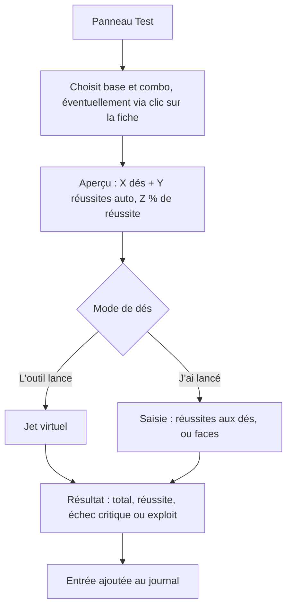
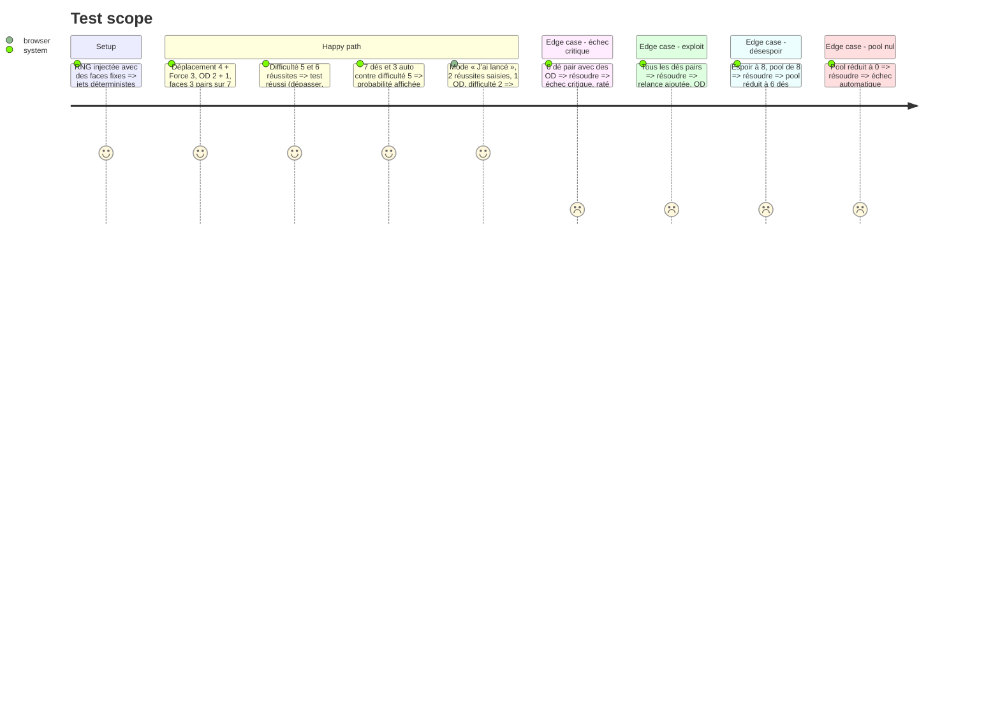

# Instruction: Moteur de dés et test de caractéristique (dés virtuels ou réels) et journal

## Architecture projection

> Tree of the final files. ✅ create · ✏️ modify · ❌ delete

```txt
.
└── src
    ├── rules
    │   ├── ✅ dice.ts               # rollD6 (RNG injectable), countSuccesses, binomial P(X > k), probabilité de réussite avec réussites auto
    │   └── ✅ test.ts               # resolveTest : pool = base + combo (+ 3ᵉ caractéristique) + modificateurs − malus d'espoir ; auto = OD ; échec critique, exploit (relance), difficulté
    ├── ✏️ config/defaultRules.ts    # seuil de désespoir (10), table des difficultés, option « sacrifier des dés », relance exploit
    ├── stores
    │   └── ✅ log.ts                # journal des jets (persisté par personnage, limite de taille)
    └── components
        ├── actions
        │   ├── ✅ TestPanel.vue     # base, combo, 3ᵉ caractéristique (héroïsme), dés ±, réussites auto ±, difficulté (liste ou nombre), aperçu de probabilité
        │   ├── ✅ DiceModeToggle.vue # « L'outil lance » ou « J'ai lancé » (saisie du nombre de réussites, ou des faces)
        │   └── ✅ RollResult.vue    # dés affichés, réussites, OD, total, réussi ou raté, échec critique, exploit
        └── ✅ LogPanel.vue
└── tests
    ├── ✅ dice.spec.ts
    └── ✅ test.spec.ts
```

## User Journey



## Test Scope



## Wireframe

```txt
┌──────────────────────────────┐
│ (1) Test                     │
│ Base [Combat ▼] Combo [Force▼]│
│ +3ᵉ carac (héroïsme) [— ▼]   │
│ Dés ± [0]  Réussites ± [0]   │
│ Difficulté [Normal (3) ▼]    │
│ (2) 7 dés + 2 auto · 77 %    │
│ (3) (•) L'outil lance        │
│     ( ) J'ai lancé : [__]    │
│ [ Lancer ]                   │
├──────────────────────────────┤
│ (4) ⚄ ⚃ ⚀ ⚅ ⚁ ⚂ ⚃ → 4 + 2 = 6 │
│     RÉUSSI (> 3)             │
└──────────────────────────────┘
```

1. Choix du combo et des modificateurs.
2. Aperçu du nombre de dés, des réussites automatiques et de la probabilité.
3. Mode de dés : virtuel ou saisie manuelle.
4. Résultat détaillé, ensuite copié dans le journal.

## Tasks to do

### `1)` Moteur de dés

> Avoir des jets et des probabilités exacts et testables.

1. `rollD6(n, rng)` avec une RNG injectable. `successes(faces)` compte les dés pairs.
2. `chanceToBeat(dice, auto, difficulty)` = P(réussites aux dés + auto > difficulté).

### `2)` Résolution d'un test

> Appliquer le système combo du référentiel (fiche 01).

1. Pool = base + combo + 3ᵉ caractéristique éventuelle + modificateurs − max(0, seuil − espoir actuel).
2. Réussites automatiques = OD de chaque caractéristique utilisée (3ᵉ comprise) + bonus.
3. Échec critique : 0 dé pair (et pool > 0), échec même avec des OD. Exploit : tous les dés pairs, une relance ajoutée (sans OD), une seule fois. Pool à 0 : échec automatique.
4. Mode manuel : on saisit soit le nombre de réussites, soit les faces. Avec seulement un nombre, l'utilisateur coche lui-même « échec critique » ou « exploit ».

### `3)` Interface et journal

> Lancer un test en quelques clics et en garder la trace.

1. `TestPanel` (pré-sélection de la base via clic sur une caractéristique de la fiche), `DiceModeToggle`, `RollResult`.
2. Store `log` et `LogPanel` : horodatage, type, détail, résultat. Bouton « Vider ».

## Test acceptance criteria

| Task | Acceptance criteria |
| ---- | ------------------- |
| 1 | Pour des faces données, les réussites sont exactes. La probabilité affichée correspond à la loi binomiale avec les réussites automatiques. |
| 2 | Échec critique, exploit, malus d'espoir sous 10 et pool à 0 se comportent comme dans le référentiel (fiche 01, fiche 05). |
| 3 | Un test est lancé ou saisi en 3 clics au plus après le choix du combo. Chaque résultat apparaît dans le journal et survit au rechargement. |
