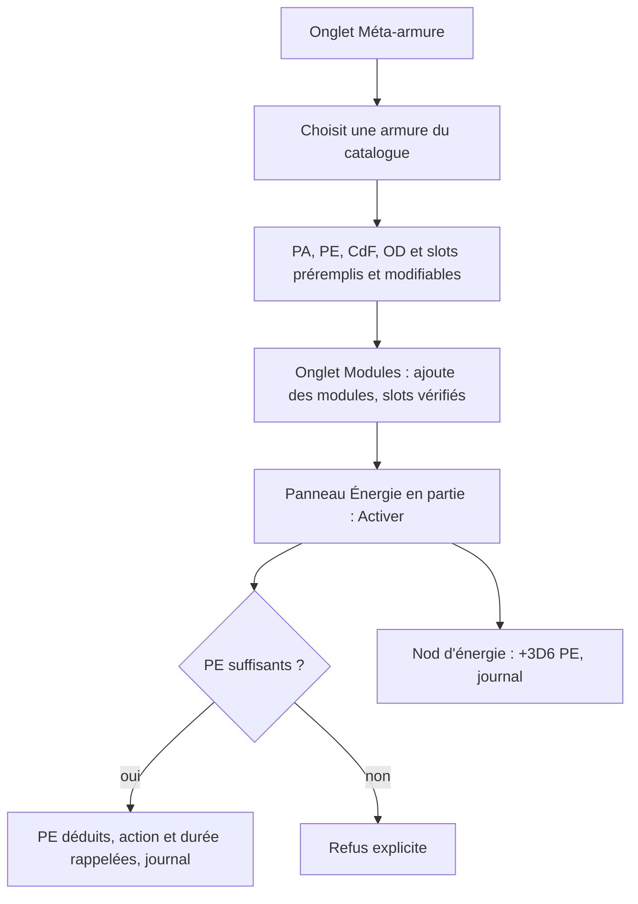
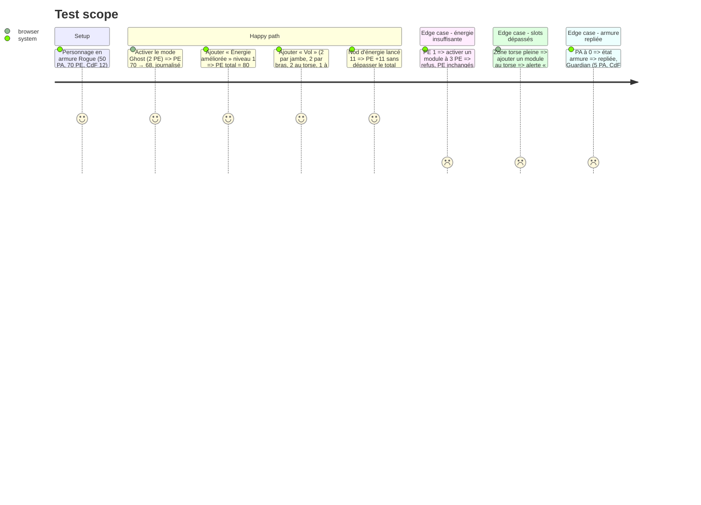

# Instruction: Méta-armure, modules et énergie

## Architecture projection

> Tree of the final files. ✅ create · ✏️ modify · ❌ delete

```txt
.
└── src
    ├── rules
    │   ├── ✏️ types.ts              # Armor, ArmorCapability (coût en PE, action, durée), ModuleDef (niveaux, slots par zone, PE, activation, durée, effet), Slots
    │   ├── ✅ armor.ts              # totaux effectifs (PA, PE, CdF + améliorations permanentes), OD effectifs (base armure + achetés + Warrior « types »), contrôle des slots par zone, déployée ou repliée (Guardian 5 PA / CdF 5)
    │   └── ✅ energy.ts             # dépense (refus si PE insuffisants), recharges : nod 3D6, repos +6 par heure, repli 6 h = plein ; à 0 PE : plus de modules ni d'OD
    ├── data
    │   ├── ✅ armors.ts             # 9 armures du LdB + Psion, Monk, Sorcerer, Necromancer, Druid (fiches 06 et 13), stats marquées « à vérifier »
    │   └── ✅ modules.ts            # modules du LdB et du codex 4 (fiche 09, fiche 13)
    ├── components
    │   ├── sheet
    │   │   ├── ✅ ArmorPanel.vue    # choix de l'armure, totaux, slots par zone (utilisés / max), OD, évolutions débloquées selon les PG totaux, déployée ou repliée
    │   │   └── ✅ ModulesPanel.vue  # ajout depuis le catalogue ou en personnalisé, niveau, slots, alerte de dépassement
    │   └── actions
    │       └── ✅ EnergyPanel.vue   # capacités d'armure et modules activables : coût en PE, action, durée, bouton Activer ; nods (énergie, armure, soin) ; repos
    └── ✏️ components/GaugesBar.vue  # totaux PA et PE issus de l'armure, indicateur repliée / Guardian
└── tests
    ├── ✅ armor.spec.ts
    └── ✅ energy.spec.ts
```

## User Journey



## Test Scope



## Wireframe

```txt
┌───────────────────────────────────────────────┐
│ (1) Méta-armure [Rogue ▼]  Gén. 2  ◉ Déployée │
│     PA 50 · PE 70 · CdF 12   (modifiables)    │
├───────────────────────────────────────────────┤
│ (2) Slots  Tête 1/5 · BrasG 0/5 · BrasD 2/5   │
│            Torse 3/8 · JambeG 2/5 · JambeD 2/5│
├───────────────────────────────────────────────┤
│ (3) Capacités : Mode Ghost — 2 PE/tour …      │
│     Évolutions : 150 ✓ · 200 ✗ · 250 ✗        │
├───────────────────────────────────────────────┤
│ (4) OD : Dépl. 1 · Dext. 1 · Discr. 1 · Comb.1│
└───────────────────────────────────────────────┘
┌──────────────────────────────┐
│ (5) Énergie  PE 68/70        │
│  Mode Ghost  2 PE  [Activer] │
│  Saut nv1    3 PE  [Activer] │
│  Nods : Énergie 3 · Armure 3 │
│  · Soin 3 · [Repos 1 h]      │
└──────────────────────────────┘
```

1. Armure : modèle, génération, état, totaux modifiables.
2. Slots par zone : occupés / disponibles.
3. Capacités et évolutions débloquées selon les PG totaux.
4. Overdrives effectifs.
5. Panneau d'actions Énergie : activations, nods, repos.

## Tasks to do

### `1)` Catalogues armures et modules

> Préremplir les profils du référentiel en restant modifiables.

1. `data/armors.ts` : stats, capacités (coût en PE, action, durée, effet en texte), évolutions (150, 200, 250 PG), drapeau `aVerifier`.
2. `data/modules.ts` : PG par niveau, disponibilité, slots par zone, PE, activation, durée, effet. Améliorations permanentes (+PA, +PE, +CdF, +slots).

### `2)` Règles d'armure et d'énergie

> Calculer les totaux effectifs et gérer l'énergie.

1. `armor.ts` : totaux avec améliorations, OD effectifs (armure + achetés + bonus temporaire « type » Warrior), slots, état déployée, repliée ou Guardian.
2. `energy.ts` : dépense avec refus, recharges (nod 3D6 virtuel ou saisi, repos +6 PE par heure, repli 6 h = plein). À 0 PE, modules et OD sont désactivés.

### `3)` Interface

> Configurer l'armure entre les parties et activer en partie.

1. `ArmorPanel` et `ModulesPanel` : choix dans le catalogue ou personnalisé, alerte de slots avec possibilité de forcer.
2. `EnergyPanel` : liste des capacités et modules activables, nods (compteurs par mission), repos. Tout passe au journal.

## Test acceptance criteria

| Task | Acceptance criteria |
| ---- | ------------------- |
| 1 | Choisir une armure préremplit PA, PE, CdF, OD, slots et capacités. Chaque valeur reste modifiable. Les valeurs « à vérifier » sont signalées. |
| 2 | Les totaux intègrent les améliorations permanentes. Une activation sans PE suffisants est refusée. Les recharges ne dépassent jamais le total. |
| 3 | Activer une capacité ou un module met à jour la jauge Énergie et le journal en un clic. Un dépassement de slots est signalé. |
