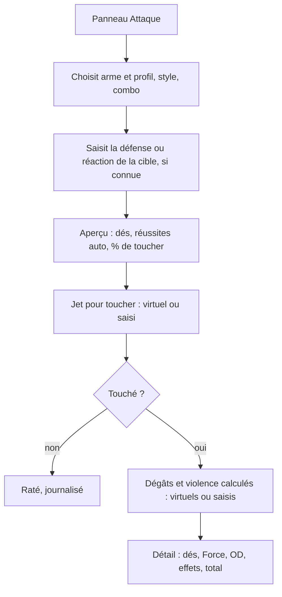

# Instruction: Armes, effets et action d'attaque

## Architecture projection

> Tree of the final files. ✅ create · ✏️ modify · ❌ delete

```txt
.
└── src
    ├── rules
    │   ├── ✏️ types.ts              # Weapon (profils multiples : contact, tir…), DiceExpr (XD6 + fixe + caractéristique), Effect {id, X}
    │   ├── ✅ effects.ts            # catalogue des effets (fiche 08, fiche 13) : description et hooks (onHit, onDamage, onViolence, modifiers)
    │   ├── ✅ styles.ts             # styles (fiche 03 + 4 styles du livret 2020) : modificateurs de dés, de défense et de réaction
    │   └── ✅ attack.ts             # toucher : réussites > défense ou réaction cible (± style, point faible ÷2, barrage, lumière) ; dégâts : jet + fixe + Force (×2 lesté) + 3 × OD Force + orfèvrerie, précision, silencieux + assistance + meurtrier, destructeur selon la cible ; violence + ultraviolence, fureur ; ordre « diviser puis soustraire »
    ├── data
    │   └── ✅ weapons.ts            # armes du LdB, de 2038 et du codex 4, améliorations d'armes à distance, Forge (codex 5)
    ├── ✏️ config/defaultRules.ts    # bonus par OD de Force (3), arrondi de l'akimbo (paramètre), mode héroïque (+N ou +ND6)
    └── components
        ├── sheet
        │   └── ✅ WeaponsPanel.vue  # armes du rack (5 max, paramètre), ajout depuis le catalogue ou en personnalisé, améliorations
        └── actions
            └── ✅ AttackPanel.vue   # arme et profil, style, combo (Combat ou Tir par défaut), cible (défense ou réaction, Chair, type, PA/CdF connus), options (point faible, héroïsme : dégâts max), aperçu de probabilité ; toucher puis dégâts et violence, en dés virtuels ou réels
└── tests
    ├── ✅ attack.spec.ts
    └── ✅ effects.spec.ts
```

## User Journey



## Test Scope

```mermaid
---
title: Test scope
---
journey
  section Setup
    Personnage Force 5, 2 OD de Force, Dextérité 4 ; RNG fixe => contexte déterministe: 5: system
  section Happy path
    Marteau-épieu 3D6 (faces 10) + Force => dégâts 10 + 5 + 6 = 21: 5: system
    Morgenstern lesté, faces 10 => dégâts 10 + 10 + 6 = 26: 5: system
    Style agressif => +3 dés à l'attaque et −2 en défense et en réaction du personnage: 5: system
    Fusil de précision, Tir 4 avec 1 OD => +4 + 1 aux dégâts (précision): 5: system
    Attaque avec 8 réussites contre une défense de 5, assistance à l'attaque => +3 dégâts: 5: system
  section Edge case - point faible
    Défense 16 avec point faible, barrage 2 et lumière 4 => défense effective 2: 1: system
  section Edge case - égalité
    Réussites égales à la défense => résoudre => raté: 1: system
  section Edge case - bande
    Cible bande de Chair 12, arme avec fureur => violence +4D6, dégâts non appliqués à la cohésion: 1: system
```

## Wireframe

```txt
┌──────────────────────────────┐
│ (1) Attaque                  │
│ Arme [Épée bâtarde ▼] [1 main▼]│
│ Style [Standard ▼]           │
│ Base [Combat] Combo [Dext. ▼]│
│ (2) Cible : Déf [5] Réac [_] │
│  Type [Hostile ▼] Chair [8]  │
│  ☐ Point faible ☐ Barrage _  │
│ (3) 8 dés + 1 auto · 64 %    │
│ [ Attaquer ] [ Dégâts seuls ]│
├──────────────────────────────┤
│ (4) Touché (7 > 5)           │
│  Dégâts 4D6=14 + For 5 + Dex4│
│  + OD 6 = 29 · Violence 2D6=7│
└──────────────────────────────┘
```

1. Choix de l'arme, du profil, du style et du combo.
2. Cible : scores d'opposition et modificateurs.
3. Aperçu et lancement.
4. Résultat détaillé (toucher, dégâts et violence décomposés).

## Tasks to do

### `1)` Données d'armes et d'effets

> Préremplir toutes les armes du référentiel et décrire chaque effet.

1. `data/weapons.ts` : profils, PG, disponibilité, effets. Armes personnalisées autorisées.
2. `effects.ts` : catalogue avec description courte et implémentation des effets **calculables** (lesté, orfèvrerie, précision, silencieux, assistance, meurtrier, destructeur, ultraviolence, fureur, barrage, lumière, choc, désignation, jumelé, deux mains, lourd, oblitération, ténébricide…). Les autres effets sont affichés en texte, comme rappel.

### `2)` Résolution de l'attaque

> Calculer le toucher et les dégâts selon les fiches 03, 08 et 11.

1. `styles.ts` : agressif, défensif, couvert, ambidextre, akimbo, plus précis, pilonnage, puissant et suppression (paramétrables).
2. `attack.ts` : opposition effective (diviser puis soustraire), toucher strict (>), dégâts et violence décomposés, mode héroïque (« +N » ou « +ND6 » selon le paramètre).

### `3)` Interface

> Attaquer en quelques clics, en dés virtuels ou réels.

1. `WeaponsPanel` (rack, améliorations) et `AttackPanel` (aperçu, toucher, puis dégâts). « Dégâts seuls » pour les jets hors attaque.

## Test acceptance criteria

| Task | Acceptance criteria |
| ---- | ------------------- |
| 1 | Chaque arme du référentiel est disponible avec son profil exact. Chaque effet a un libellé et une description. |
| 2 | Les exemples chiffrés du livre (LdB p. 81, 91, 415-418) sont reproduits par les tests. L'égalité avec la défense donne un échec. |
| 3 | Une attaque complète (toucher puis dégâts) se fait en 2 actions utilisateur après la sélection de l'arme. Le détail du calcul est visible et journalisé. |
