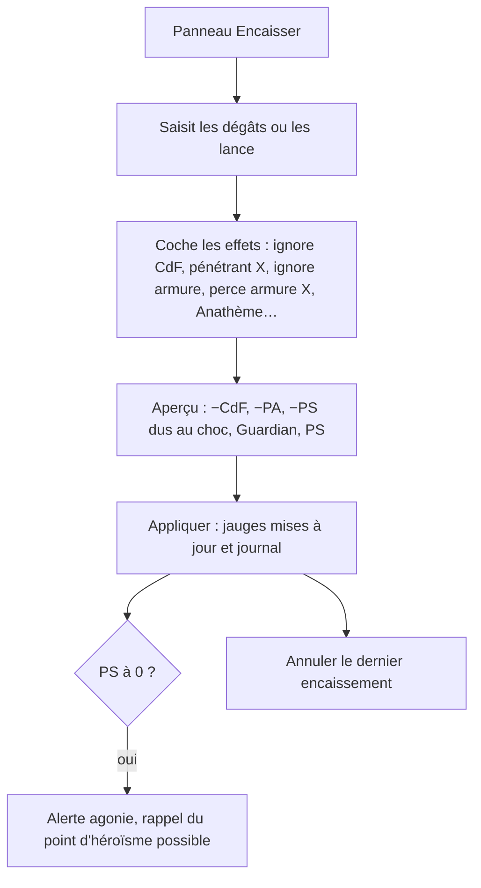
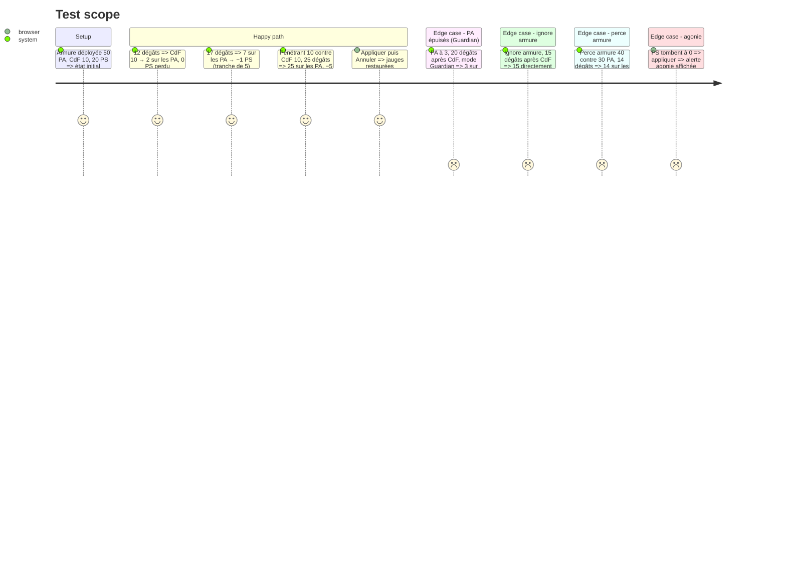

# Instruction: Encaisser les dégâts

## Architecture projection

> Tree of the final files. ✅ create · ✏️ modify · ❌ delete

```txt
.
└── src
    ├── rules
    │   └── ✅ soak.ts               # pipeline : dégâts → CdF (sauf ignore CdF, pénétrant X ; + plus gros bonus seulement) → PA (sauf ignore armure, perce armure X ≥ PA) avec −1 PS par tranche de 5 PA perdus (sauf Infatigable) → excédent vers Guardian ou PS (paramètre) → PS → agonie ; 4ᵉ génération sans PS ; pertes d'espoir (Anathème) ou d'énergie (drain)
    ├── ✏️ config/defaultRules.ts    # « excédent après 0 PA » : Guardian (FAQ 2020, défaut) ou PS (LdB) ; taille de tranche (5) ; Guardian 5 PA / CdF 5
    ├── stores
    │   └── ✏️ characters.ts         # appliquer le résultat ; annuler le dernier encaissement (snapshot)
    └── components
        └── actions
            └── ✅ SoakPanel.vue     # dégâts reçus (saisis ou jetés : XD6 + fixe), effets de l'attaque (cases à cocher, X), cible (PS, PEs, PE) ; aperçu de la répartition ; Appliquer ; Annuler
└── tests
    └── ✅ soak.spec.ts
```

## User Journey



## Test Scope



## Wireframe

```txt
┌──────────────────────────────┐
│ (1) Encaisser                │
│ Dégâts [17] ou [3D6+6][🎲]   │
│ ☐ Ignore CdF ☐ Pénétrant [_] │
│ ☐ Ignore armure ☐ Perce [_]  │
│ ☐ Anathème (→ espoir)        │
│ ☐ Drain (→ énergie)          │
│ (2) CdF −10 → PA −7 → PS −1  │
│ [ Appliquer ]  [ Annuler ]   │
└──────────────────────────────┘
```

1. Saisie ou jet des dégâts, et effets de l'attaque reçue.
2. Aperçu de la répartition, avant validation.

## Tasks to do

### `1)` Pipeline d'encaissement

> Appliquer l'ordre du référentiel (fiche 06, FAQ 2020), avec ses variantes paramétrées.

1. `soak.ts` : fonction pure `soak(state, hit, rules)` qui renvoie la répartition détaillée et le nouvel état.
2. Gérer les bonus de CdF (le plus gros seulement), Infatigable, colosse (non applicable au PJ), armure de 4ᵉ génération (pas de PS), Anathème et drain.

### `2)` Application et annulation

> Modifier la fiche en sécurité.

1. Appliquer met à jour les jauges et l'état de l'armure (repliée ou Guardian), et écrit dans le journal.
2. Un snapshot permet d'annuler le dernier encaissement.

### `3)` Interface

> Encaisser en 2 clics.

1. `SoakPanel` : saisie, effets, aperçu, Appliquer, Annuler, alerte d'agonie.

## Test acceptance criteria

| Task | Acceptance criteria |
| ---- | ------------------- |
| 1 | Les exemples du livre (LdB p. 131 : 12 dégâts contre CdF 10, 7 dégâts sur les PA donnent −1 PS) et ceux de la FAQ 2020 sont reproduits. Le paramètre « excédent » change le résultat comme prévu. |
| 2 | Après Appliquer, les jauges reflètent la répartition affichée. Annuler restaure exactement l'état précédent. |
| 3 | La répartition est visible avant validation. Une mise à 0 PS déclenche l'alerte d'agonie. |
