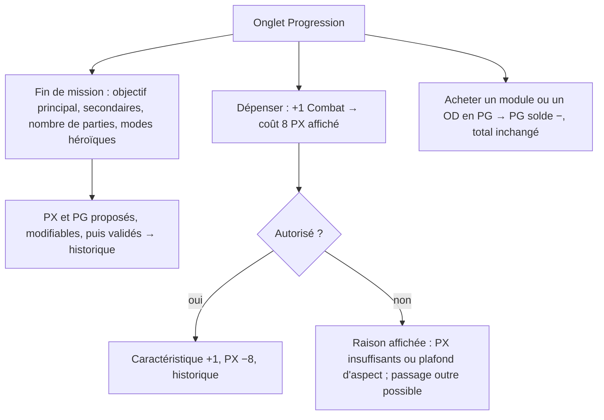
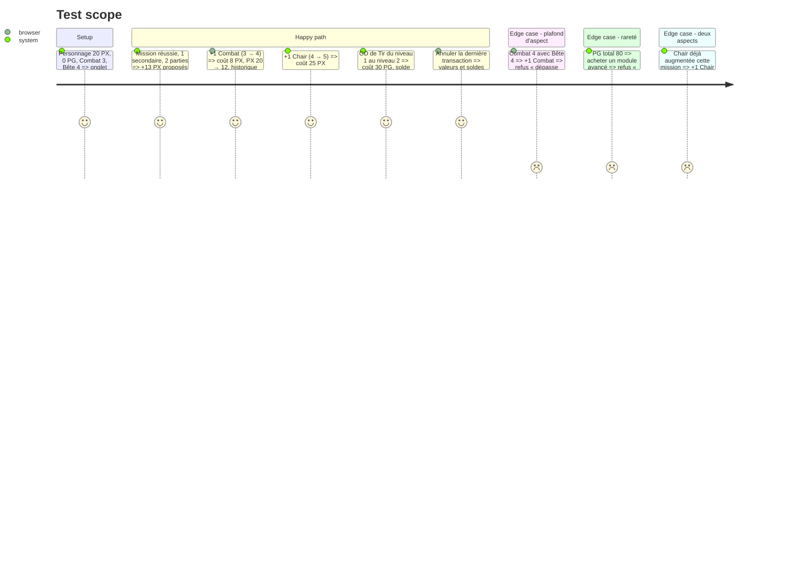

# Instruction: Progression entre les parties — PX, PG et historique

## Architecture projection

> Tree of the final files. ✅ create · ✏️ modify · ❌ delete

```txt
.
└── src
    ├── rules
    │   ├── ✏️ types.ts              # Progression {pxActuel, pxTotal, pgSolde, pgTotal, historique[]}, Transaction {date, type, libellé, ΔPX, ΔPG, changement}
    │   └── ✅ progression.ts        # gains de fin de mission (PX : 5 + 5 + 2/partie + 1/secondaire ; PG : 10-20 + 5/secondaire + 5/héroïque) ; coûts : aspect = nouveau × 5, caractéristique = nouveau × 2, OD = 10/30/50/70/100 ; contrôles (aspect ≤ 9, caractéristique ≤ aspect, un aspect par mission, rareté selon PG total) ; achats en PG
    ├── ✏️ config/defaultRules.ts    # tous les coûts et gains ci-dessus, paliers 100/300/500, max héroïsme, limite d'implants
    └── components
        └── sheet
            ├── ✅ ProgressionPanel.vue  # soldes ; « Fin de mission » (assistant de gains) ; boutons « +1 » avec coût affiché sur aspects, caractéristiques et OD ; achats d'équipement ; historique
            └── ✅ HistoryList.vue       # transactions, annulation de la dernière
└── tests
    └── ✅ progression.spec.ts
```

## User Journey



## Test Scope



## Wireframe

```txt
┌───────────────────────────────────────────────┐
│ (1) PX 12 / total 33   PG solde 30 / total 60 │
│     [ Fin de mission… ]                       │
├───────────────────────────────────────────────┤
│ (2) Améliorer                                 │
│  Combat 3 → 4 : 8 PX  [+1]                    │
│  Chair  4 → 5 : 25 PX [+1]                    │
│  OD Tir 1 → 2 : 30 PG [+1]                    │
├───────────────────────────────────────────────┤
│ (3) Historique                                │
│  01/10 Mission « … » +13 PX +20 PG            │
│  01/10 Combat 3→4   −8 PX            [Annuler]│
└───────────────────────────────────────────────┘
```

1. Soldes (actuel et total) et assistant de fin de mission.
2. Améliorations avec leur coût calculé et leurs contrôles.
3. Historique annulable.

## Tasks to do

### `1)` Règles de progression

> Calculer gains et coûts selon la fiche 07, avec des paramètres.

1. `progression.ts` : fonctions pures de gains et de coûts, contrôles renvoyant des raisons lisibles.
2. Le PG total ne baisse jamais. Les dépenses ne touchent que le solde.

### `2)` Historique et annulation

> Tracer chaque gain et chaque dépense.

1. Transaction avec un instantané de la donnée modifiée. Annulation de la dernière.

### `3)` Interface

> Préparer le personnage entre les parties sans calcul mental.

1. `ProgressionPanel` et `HistoryList`. Assistant « Fin de mission » avec des valeurs proposées et modifiables. Passage outre explicite pour les règles maison.

## Test acceptance criteria

| Task | Acceptance criteria |
| ---- | ------------------- |
| 1 | Les coûts et gains des exemples du livre (LdB p. 107-108 : 13 PX, Combat 3→4 = 8 PX, Chair 4→5 = 25 PX) sont reproduits. Les paliers 100/300/500 bloquent les achats correspondants. |
| 2 | Chaque gain ou dépense apparaît dans l'historique. Annuler restaure les valeurs et les soldes. |
| 3 | Le coût est affiché avant chaque achat. Un refus indique sa raison et propose un passage outre. |
