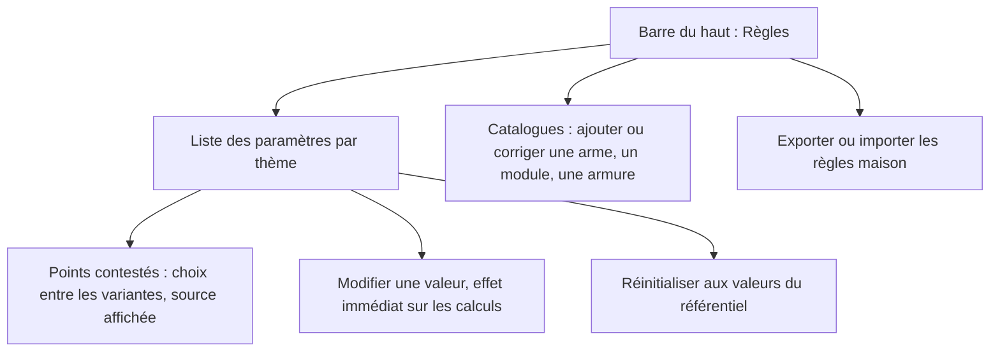
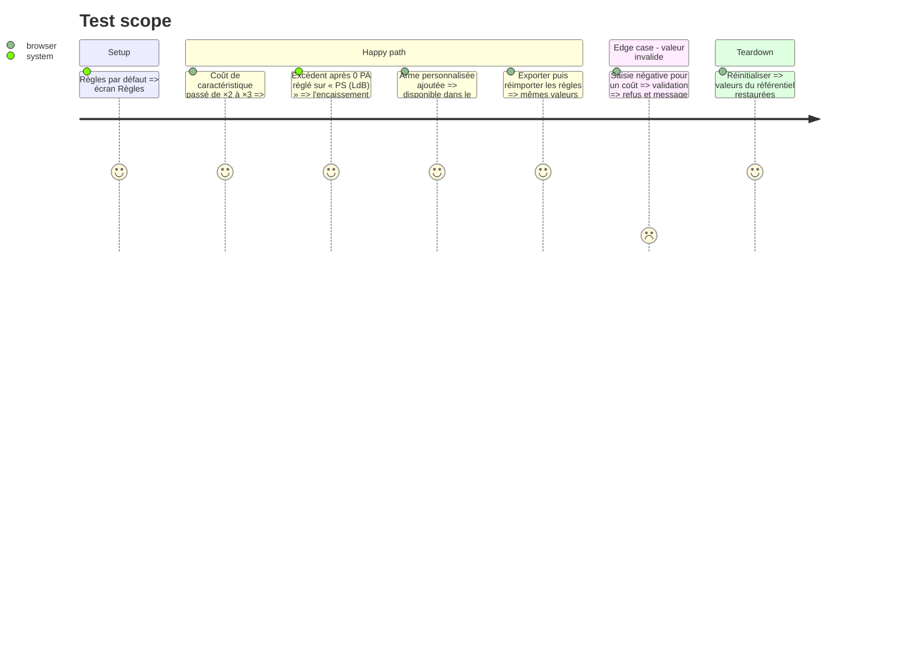

# Instruction: Règles maison — écran des paramètres et catalogues modifiables

## Architecture projection

> Tree of the final files. ✅ create · ✏️ modify · ❌ delete

```txt
.
└── src
    ├── stores
    │   └── ✅ rules.ts              # RulesConfig effective = défauts + surcharges (persistées, par profil de règles), réinitialisation
    ├── ✏️ config/defaultRules.ts    # chaque paramètre a un libellé, une source (fiche du référentiel et page) et un drapeau « contesté »
    ├── ✏️ services/fileIO.ts        # export et import des règles maison et des entrées personnalisées des catalogues
    └── components
        ├── ✅ SettingsView.vue      # paramètres groupés (système, combat, encaisser, énergie, progression) ; les 8 points contestés mis en avant avec les valeurs possibles
        └── ✅ CatalogEditor.vue     # ajouter, modifier ou masquer des armures, armes, modules et effets personnalisés
    └── ✏️ components/TopBar.vue     # accès « Règles »
└── tests
    └── ✅ rules.spec.ts
```

## User Journey



## Test Scope



## Wireframe

```txt
┌───────────────────────────────────────────────┐
│ (1) Règles maison   [Exporter] [Importer] [⟲] │
├───────────────┬───────────────────────────────┤
│ (2) Thèmes    │ (3) Points contestés ⚠        │
│  Système      │  Excédent après 0 PA :        │
│  Combat       │   (•) Guardian (FAQ 2020)     │
│  Encaisser    │   ( ) Santé (LdB p. 413)      │
│  Énergie      │  Borealis plasma : [1] PE     │
│  Progression  │ (4) Paramètres du thème       │
│  Catalogues   │  Coût caractéristique ×[2]    │
└───────────────┴───────────────────────────────┘
```

1. En-tête : import, export et réinitialisation.
2. Navigation par thème.
3. Les 8 points à vérifier du référentiel, avec leurs variantes et leur source.
4. Paramètres du thème sélectionné.

## Tasks to do

### `1)` Store des règles

> Rendre chaque valeur de règle modifiable et persistée.

1. `stores/rules.ts` : fusion des défauts et des surcharges. Tous les modules `src/rules/*` reçoivent la config en paramètre (pas d'import direct des défauts).
2. Métadonnées : libellé, source, bornes, drapeau « contesté ».

### `2)` Écran des paramètres et éditeur de catalogues

> Permettre les règles maison sans toucher au code.

1. `SettingsView` avec validation des bornes et la mise en avant des 8 points contestés (Guardian ou PS, akimbo, Borealis, casser une arme, mode héroïque, slots et OD, véhicules, coûts illisibles).
2. `CatalogEditor` pour les entrées personnalisées (fusionnées avec les catalogues fournis).

### `3)` Import et export des règles

> Partager ou sauvegarder ses règles maison.

1. Fichier `.knightplay-rules.json` validé à l'import.

## Test acceptance criteria

| Task | Acceptance criteria |
| ---- | ------------------- |
| 1 | Modifier un paramètre change immédiatement les calculs concernés (test, attaque, encaissement, énergie, progression). |
| 2 | Chaque point contesté du référentiel est réglable et indique sa source. Une valeur hors bornes est refusée. Une entrée personnalisée apparaît dans les panneaux. |
| 3 | Des règles exportées puis réimportées redonnent la même configuration. Réinitialiser restaure les valeurs du référentiel. |
