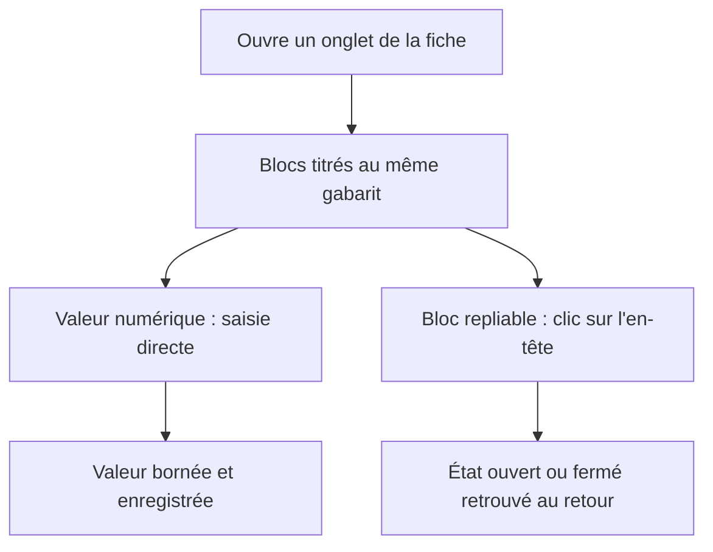
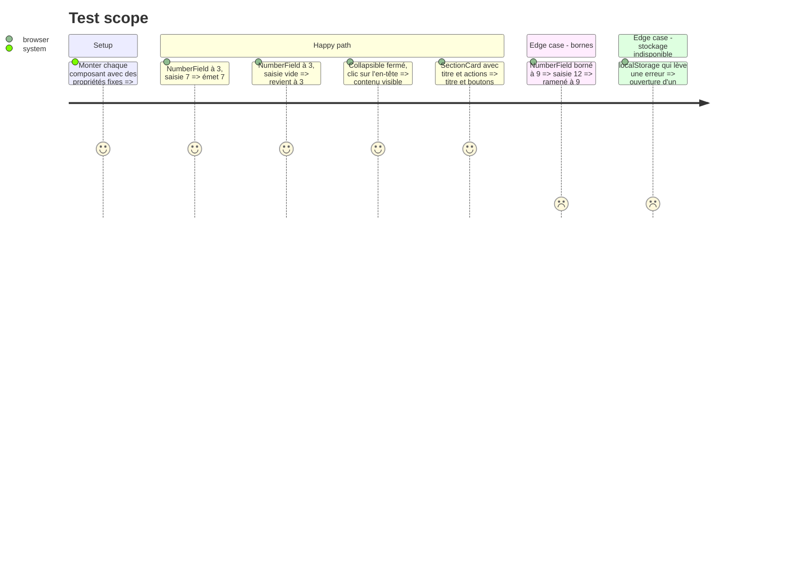

# Instruction: Socle visuel et composants communs

## Architecture projection

> Tree of the final files. ✅ create · ✏️ modify · ❌ delete

```txt
.
└── src
    ├── styles
    │   ├── ✏️ base.css              # jetons d'espacement, de typographie et de rayon ; largeur minimale des champs numériques ; états de focus ; nettoyage des règles en double
    │   └── ✅ components.css        # styles des composants communs ci-dessous
    ├── components
    │   └── ui
    │       ├── ✅ SectionCard.vue   # bloc titré (titre, sous-titre, actions à droite, contenu), variante repliable
    │       ├── ✅ NumberField.vue   # champ numérique compact à saisie directe (sans boutons − / +), largeur selon le nombre de chiffres, bornes min / max
    │       ├── ✅ StatTile.vue      # grande valeur avec libellé et note (lecture), couleur d'accent
    │       └── ✅ Collapsible.vue   # en-tête cliquable + contenu, état ouvert mémorisé (localStorage, avec repli)
    └── ✏️ main.ts                   # import de components.css
└── tests
    └── ✅ ui.spec.ts
```

## User Journey



## Test Scope



## Tasks to do

### `1)` Jetons et correctifs globaux

> Une base cohérente pour tous les onglets.

1. Déclarer dans `:root` des jetons d'espacement, de taille de police et de rayon ; les utiliser dans les nouvelles règles.
2. Largeur minimale des `input[type=number]` selon le nombre de chiffres attendus (classes `w-2ch`, `w-3ch`, `w-4ch`) : plus aucune valeur rognée.
3. Contour de focus visible et homogène pour champs, boutons et onglets.
4. Repérer et supprimer les règles CSS en double ou mortes de `base.css`.

### `2)` Composants communs

> Factoriser les motifs répétés des panneaux.

1. `SectionCard` : titre, sous-titre, emplacement d'actions, option repliable.
2. `NumberField` : saisie directe, `v-model`, bornes appliquées à la validation, largeur adaptée (pas de boutons − / +, choix validé sur la maquette).
3. `StatTile` : valeur en grand, libellé, note, accent de couleur.
4. `Collapsible` : en-tête accessible (bouton, `aria-expanded`), mémorisation par clé.

## Test acceptance criteria

| Task | Acceptance criteria |
| ---- | ------------------- |
| 1 | À 1366 px, aucun champ numérique de la fiche n'affiche une valeur rognée ; le focus clavier est visible sur chaque contrôle. |
| 2 | Les quatre composants fonctionnent seuls (tests), respectent leurs bornes et restent utilisables sans localStorage. |
