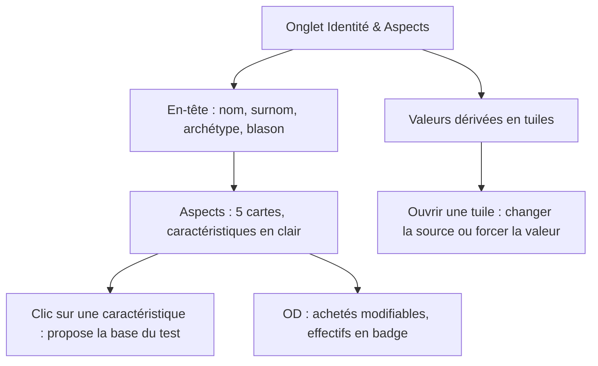
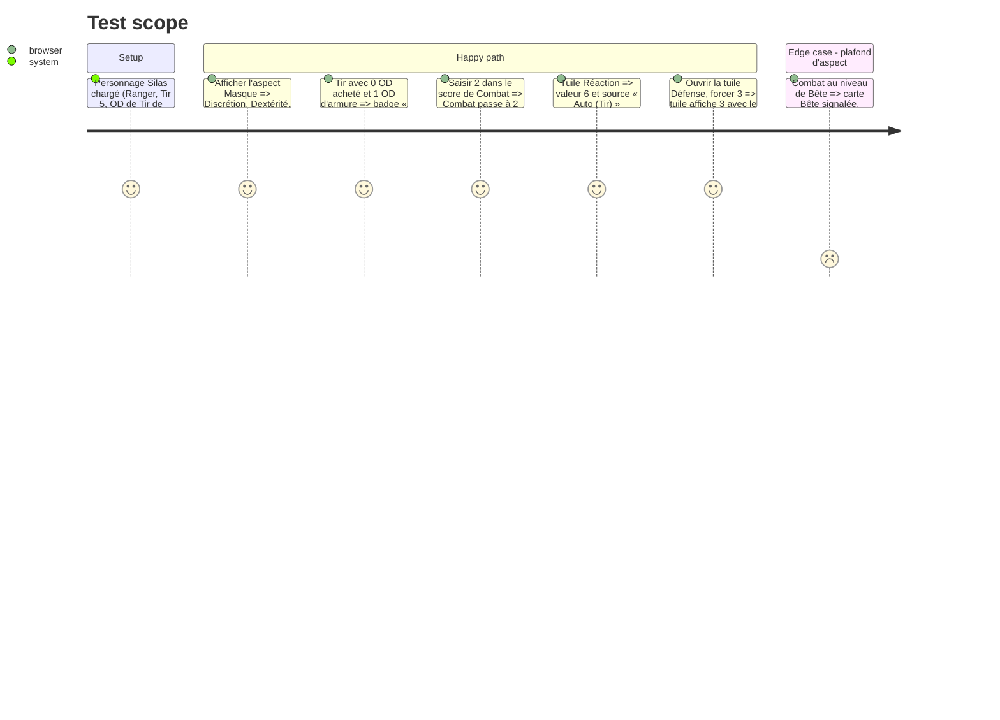

# Instruction: Onglet Identité & Aspects

## Architecture projection

> Tree of the final files. ✅ create · ✏️ modify · ❌ delete

```txt
.
└── src
    └── components
        └── sheet
            ├── ✏️ AspectsPanel.vue      # cartes d'aspect plus larges, noms complets, OD achetés / effectifs explicites, saisie directe (NumberField)
            ├── ✏️ DerivedPanel.vue      # valeurs dérivées en tuiles ; source et valeur manuelle dans un détail repliable par tuile
            ├── ✏️ IdentityPanel.vue     # formulaire en deux colonnes (Identité / Histoire), description qui s'agrandit, avantages et inconvénients en puces avec effet
            └── ✏️ ../../App.vue         # ordre : Identité en tête, puis Aspects, puis Valeurs dérivées
└── tests
    └── ✏️ derived.spec.ts, ✏️ persistence.spec.ts (sélecteurs inchangés), ✅ sheet-layout.spec.ts
```

## User Journey



## Test Scope



## Wireframe

```txt
┌──────────────────────────────────────────────────────────────┐
│ (1) Silas Shark « Eraser » · Société secrète · Blason Corbeau │
├──────────────────────────────────────────────────────────────┤
│ (2) Aspects                                                   │
│ ┌ Chair 2 ──────┐┌ Bête 2 ───────┐┌ Machine 5 ────┐           │
│ │ Déplacement 1 ││ Hargne      1 ││ Tir     5 OD1 │           │
│ │  score [1] OD ││ Combat      1 ││ Savoir  3     │           │
│ │ Force       1 ││ Instinct    1 ││ Technique 5   │           │
│ └───────────────┘└───────────────┘└───────────────┘           │
│ ┌ Dame 4 ───────┐┌ Masque 3 ─────┐                            │
│ └───────────────┘└───────────────┘                            │
├──────────────────────────────────────────────────────────────┤
│ (3) Défense 1 │ Réaction 6 │ Initiative 4 │ PS 16 │ Contacts 4 │
│     ▸ source / manuel (repliable par tuile)                    │
├───────────────────────────────┬──────────────────────────────┤
│ (4) Identité                  │ (5) Histoire                 │
│  nom · surnom · archétype     │  description (grande zone)   │
│  haut fait · blason · section │  motivation majeure          │
│  vœu · âge                    │  motivations mineures        │
├───────────────────────────────┴──────────────────────────────┤
│ (6) Avantages ● effet   │ Inconvénients ● effet              │
└──────────────────────────────────────────────────────────────┘
```

1. En-tête : identité résumée, toujours visible en haut de l'onglet.
2. Aspects : 3 cartes par ligne, noms complets, score et OD par caractéristique.
3. Valeurs dérivées : tuiles, détails de calcul repliés.
4. Identité : champs courts en grille.
5. Histoire : textes longs avec une vraie zone de saisie.
6. Avantages et inconvénients : puces avec leur effet.

## Tasks to do

### `1)` Aspects et caractéristiques

> Lire et modifier scores et OD sans ambiguïté.

1. Grille de 3 cartes par ligne ; noms de caractéristiques complets.
2. Score et OD achetés en saisie directe (`NumberField`, sans boutons − / +) ; badge « OD n » des OD effectifs quand ils diffèrent (armure, type Warrior, armure repliée).
3. Garder le clic sur le nom pour proposer la base du test ; avertissements de plafond dans la carte concernée.

### `2)` Valeurs dérivées

> Voir les 6 valeurs d'un coup d'œil.

1. Tuiles `StatTile` pour défense, réaction, initiative, PS, contacts, espoir.
2. Source et valeur manuelle dans un détail repliable par tuile ; marqueur « manuel » quand une valeur est forcée.
3. Bonus permanents (PS, espoir) déplacés dans les tuiles concernées.

### `3)` Identité et histoire

> Un formulaire court à remplir, des textes longs confortables.

1. Deux colonnes : champs courts à gauche, textes longs à droite.
2. Description qui s'agrandit avec son contenu.
3. Avantages et inconvénients en puces avec leur effet ; ajout via la liste existante.

## Test acceptance criteria

| Task | Acceptance criteria |
| ---- | ------------------- |
| 1 | À 1366 px, aucun nom de caractéristique n'est tronqué ; les OD effectifs se lisent sans survol. |
| 2 | Les 6 valeurs dérivées tiennent sur une ligne ; une valeur forcée est signalée et se rétablit en un clic. |
| 3 | La description affiche au moins 6 lignes sans défilement interne ; chaque avantage connu montre son effet. |
