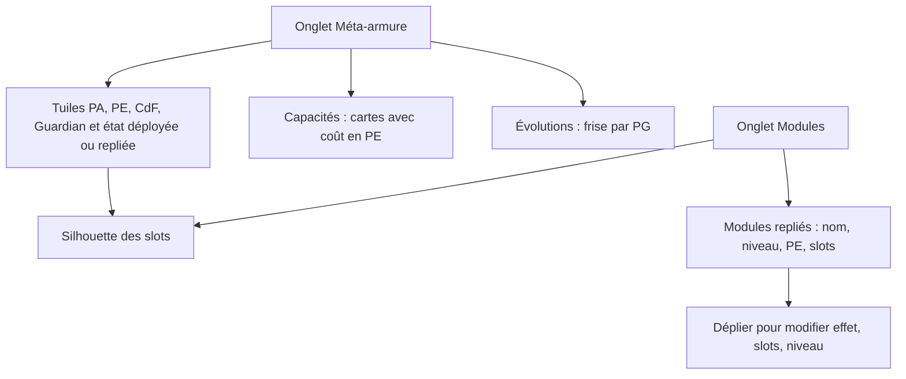
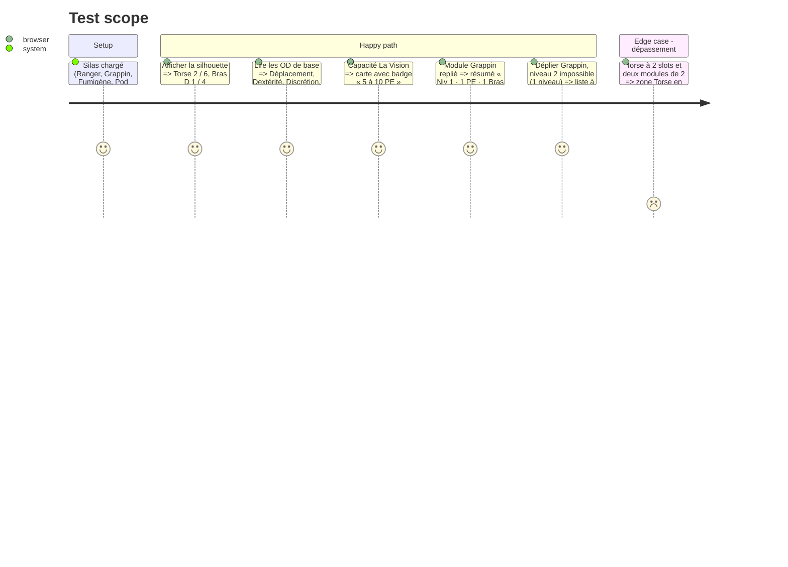

# Instruction: Méta-armure et Modules

## Architecture projection

> Tree of the final files. ✅ create · ✏️ modify · ❌ delete

```txt
.
└── src
    └── components
        └── sheet
            ├── ✏️ ArmorPanel.vue         # en-tête d'armure (modèle, état, tuiles PA / PE / CdF / Guardian), OD de base lisibles, capacités en cartes avec badge PE, évolutions en frise
            ├── ✅ SlotMap.vue            # silhouette des 6 zones (tête, bras, torse, jambes) : occupés / total et barre par zone, alerte de dépassement
            └── ✏️ ModulesPanel.vue       # SlotMap en tête, modules en cartes repliables (résumé : nom, niveau, PE, slots)
└── tests
    ├── ✏️ armor.spec.ts (sélecteurs conservés)
    └── ✅ slotmap.spec.ts
```

## User Journey



## Test Scope



## Wireframe

```txt
┌──────────────────────────────────────────────────────────────┐
│ (1) [Ranger ▼] nom [Ranger]   (Déployée | Repliée)  ⚠ à vérifier│
├──────────────────────────────────────────────────────────────┤
│ (2) PA 50/50 │ PE 70/70 │ CdF 12 │ Guardian 5 PA · CdF 5     │
├───────────────────────┬──────────────────────────────────────┤
│ (3) Slots             │ (4) OD de base                        │
│      [Tête 0/4]       │  Chair  : Dépl. [1] Force [0] End.[0] │
│ [BrG 0/4][Torse 2/6]  │  Bête   : …                           │
│      [BrD 1/4]        │  Machine: Tir [1] …                   │
│ [JbG 0/4][JbD 0/4]    │  …                                    │
├───────────────────────┴──────────────────────────────────────┤
│ (5) Capacités : ┌ La Vision · 5-10 PE ┐ ┌ Longbow · 1 PE ┐    │
├──────────────────────────────────────────────────────────────┤
│ (6) Évolutions : 50 ●──50 ●──50 ○──100 ○   PG totaux 110      │
└──────────────────────────────────────────────────────────────┘
```

1. Choix du modèle, nom, état et alerte « à vérifier ».
2. Tuiles des valeurs de l'armure (base et total).
3. Silhouette des slots, partagée avec l'onglet Modules.
4. OD de base par aspect, champs lisibles.
5. Capacités en cartes avec coût en PE.
6. Évolutions en frise, achetées ou débloquées.

## Tasks to do

### `1)` Onglet Méta-armure

> Voir l'armure comme une fiche d'équipement.

1. En-tête et tuiles PA / PE / CdF / Guardian (base en saisie directe sans boutons − / +, total affiché).
2. OD de base en grille par aspect avec champs à la bonne largeur.
3. Capacités en cartes (nom, coût PE en badge, activation, durée, effet).
4. Évolutions en frise : seuil, état (débloquée, achetée, à acheter), bouton d'achat.

### `2)` Silhouette des slots

> Lire l'occupation de l'armure d'un regard.

1. `SlotMap` : 6 zones disposées comme un corps (disposition validée sur la maquette), occupés / total, barre de remplissage, modules installés dans chaque zone.
2. Zone en dépassement en rouge ; modification des totaux depuis l'onglet Méta-armure.

### `3)` Onglet Modules

> Une liste courte, détaillée à la demande.

1. `SlotMap` en tête de l'onglet.
2. Modules en cartes repliables avec résumé ; édition complète dans le contenu déplié.

## Test acceptance criteria

| Task | Acceptance criteria |
| ---- | ------------------- |
| 1 | Toutes les valeurs d'OD de base sont lisibles ; chaque capacité montre son coût en PE sans survol. |
| 2 | La silhouette affiche les 6 zones avec occupés / total ; un dépassement est signalé en rouge. |
| 3 | Avec 3 modules repliés, l'onglet tient sans défilement à 1366 × 900 ; déplier un module donne accès à toute son édition. |
