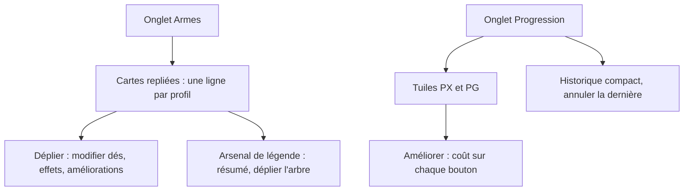
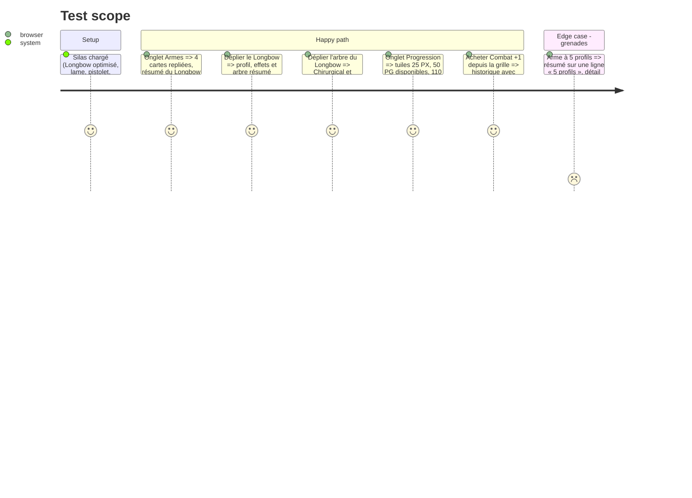

# Instruction: Armes et Progression

## Architecture projection

> Tree of the final files. ✅ create · ✏️ modify · ❌ delete

```txt
.
└── src
    └── components
        └── sheet
            ├── ✏️ WeaponsPanel.vue       # armes en cartes repliables : résumé (profils, dégâts / violence, portée, effets) ; édition et améliorations dans le contenu déplié
            ├── ✏️ LegendTree.vue         # arbre replié par défaut, résumé « châssis · PG investis · n optimisations »
            ├── ✏️ ProgressionPanel.vue   # soldes en tuiles ; améliorations en grille plus aérée ; achats regroupés
            └── ✏️ HistoryList.vue        # historique compact avec icône par type et totaux PX / PG
└── tests
    ├── ✏️ attack.spec.ts, ✏️ legend.spec.ts, ✏️ progression.spec.ts (sélecteurs conservés)
    └── ✅ weapons-layout.spec.ts
```

## User Journey



## Test Scope



## Wireframe

```txt
┌──────────────────────────────────────────────────────────────┐
│ (1) Armes 4/5   [catalogue ▼][Ajouter]  [personnalisée][Ajouter]│
├──────────────────────────────────────────────────────────────┤
│ (2) ▸ Fusil Longbow · 3D6/1D6 · moyenne · lourd, fatal…  20 PG│
│ (2) ▾ Lame polymorphique · 2D6+Force/1D6 · contact            │
│      profil [dés][violence][portée][effets]                    │
│      ▸ Arsenal de légende : aucun châssis (choisir)            │
│      ▸ Améliorations · notes                                   │
│ (2) ▸ Grenades intelligentes · 5 profils · courte             │
└──────────────────────────────────────────────────────────────┘
┌──────────────────────────────────────────────────────────────┐
│ (3) PX 25 │ PX totaux 25 │ PG 50 │ PG gagnés 110 · Renommée   │
├──────────────────────────────────────────────────────────────┤
│ (4) Améliorer : grille d'aspects, coût sur chaque bouton       │
├───────────────────────────────┬──────────────────────────────┤
│ (5) Acheter en PG             │ (6) Historique  [Annuler]     │
└───────────────────────────────┴──────────────────────────────┘
```

1. Ajout d'armes (catalogue ou personnalisée), compteur du rack.
2. Une carte par arme, résumé lisible replié, édition complète déplié.
3. Soldes en tuiles avec la renommée.
4. Améliorations d'aspects, caractéristiques et OD.
5. Achats en PG (modules, armes, autres).
6. Historique compact, annulation de la dernière transaction.

## Tasks to do

### `1)` Onglet Armes

> Le rack se lit en quelques lignes.

1. Cartes repliables avec résumé par profil (dégâts, violence, portée, effets en puces).
2. Édition des profils, améliorations et notes dans le contenu déplié.
3. Arsenal de légende : résumé (châssis, PG investis, optimisations acquises), arbre déplié à la demande.

### `2)` Onglet Progression

> Préparer la prochaine mission sans chercher.

1. Soldes en `StatTile`, renommée en sous-titre.
2. Grille d'améliorations plus aérée ; boutons avec coût et état (possible, à outrepasser, bloqué).
3. Achats et historique côte à côte ; icône par type de transaction.

## Test acceptance criteria

| Task | Acceptance criteria |
| ---- | ------------------- |
| 1 | Avec 4 armes repliées, l'onglet tient sur un écran ; chaque résumé donne dégâts, violence et portée de chaque profil. |
| 2 | Les soldes se lisent en grand ; le coût de chaque amélioration est visible avant le clic. |
