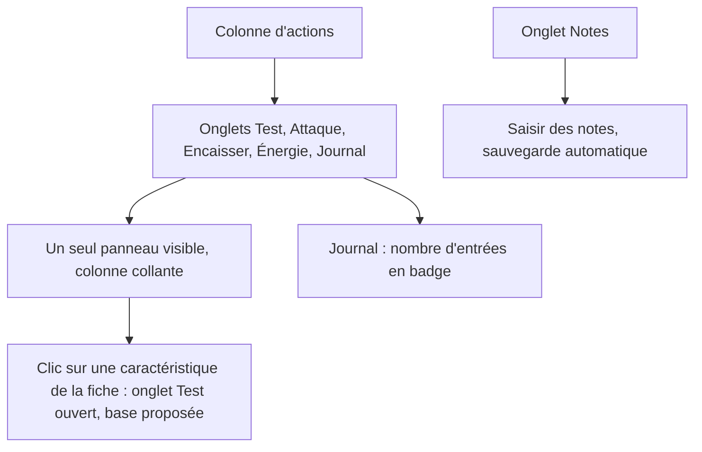
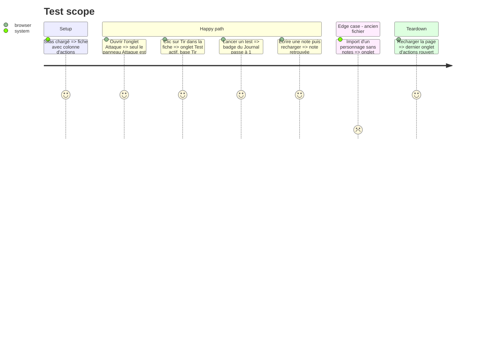

# Instruction: Colonne d'actions en onglets et onglet Notes

## Architecture projection

> Tree of the final files. ✅ create · ✏️ modify · ❌ delete

```txt
.
└── src
    ├── rules
    │   └── ✏️ types.ts                # Character.notes (texte libre)
    ├── ✏️ rules/catalog.ts             # blankSheet : notes vides
    ├── ✏️ stores/persistence.ts        # normalisation des notes (chaîne)
    ├── ✏️ stores/characters.ts         # setNotes
    ├── components
    │   ├── ✅ ActionsPanel.vue         # onglets Test · Attaque · Encaisser · Énergie · Journal, badge du nombre d'entrées du journal, onglet mémorisé
    │   ├── sheet
    │   │   └── ✅ NotesPanel.vue       # notes de session et de campagne, zone qui s'agrandit, enregistrement automatique
    │   └── ✏️ ../App.vue               # ActionsPanel dans l'aside (colonne collante), NotesPanel dans l'onglet Notes
    └── ✏️ styles/base.css              # colonne d'actions collante et défilable
└── tests
    ├── ✏️ test.spec.ts, ✏️ energy.spec.ts (montage via l'onglet), ✅ actions-panel.spec.ts
    └── ✏️ persistence.spec.ts (notes conservées)
```

## User Journey



## Test Scope



## Wireframe

```txt
┌──────────────────────────────────────┬───────────────────────┐
│ (1) Fiche (onglets d'édition)         │ (2) Test│Attaque│Enc.│ │
│                                       │     Énergie│Journal (3)│
│                                       ├───────────────────────┤
│                                       │ (3) panneau actif     │
│                                       │     (collant, défile  │
│                                       │      seul)            │
└──────────────────────────────────────┴───────────────────────┘
┌──────────────────────────────────────────────────────────────┐
│ (4) Notes                                                     │
│  ┌ Notes de session ───────────────────────────────────────┐  │
│  │                                                          │  │
│  └──────────────────────────────────────────────────────────┘  │
└──────────────────────────────────────────────────────────────┘
```

1. Fiche : onglets d'édition des phases précédentes.
2. Onglets d'actions, avec le nombre d'entrées du journal.
3. Panneau d'action actif, colonne collante à l'écran.
4. Onglet Notes : texte libre du joueur, sauvegardé avec la fiche.

## Tasks to do

### `1)` Colonne d'actions en onglets

> Une action à la fois, toujours à portée.

1. `ActionsPanel` : onglets accessibles (`role="tablist"`), onglet mémorisé, badge du journal.
2. Colonne collante (`position: sticky`) qui défile indépendamment de la fiche.
3. Le clic sur une caractéristique ouvre l'onglet Test avec la base proposée.

### `2)` Onglet Notes

> Garder ses notes de partie avec le personnage.

1. Champ `notes` du personnage, normalisé à l'import et à l'export.
2. `NotesPanel` : zone de texte qui s'agrandit, sauvegarde automatique, compteur de caractères.

## Test acceptance criteria

| Task | Acceptance criteria |
| ---- | ------------------- |
| 1 | Un seul panneau d'action est affiché ; la colonne reste visible en faisant défiler la fiche ; l'onglet choisi est retrouvé au rechargement. |
| 2 | Une note saisie est conservée au rechargement et dans l'export ; un ancien fichier sans notes s'importe sans erreur. |
