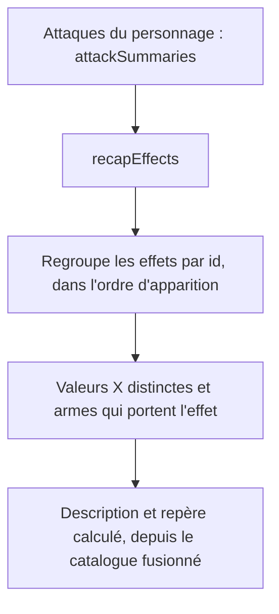
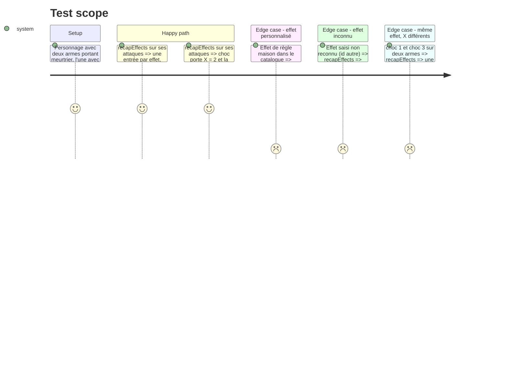

# Instruction: Calcul du lexique des effets

## Architecture projection

> Tree of the final files. ✅ create · ✏️ modify · ❌ delete

```txt
.
├── src/rules/recap.ts        ✏️ ajoute RecapEffect et recapEffects()
└── tests/recap.spec.ts       ✏️ tests du lexique
```

## User Journey



## Test Scope



## Tasks to do

### `1)` Type et fonction `recapEffects`

> Produire la liste dédupliquée des effets des attaques, prête à afficher.

1. Dans `src/rules/recap.ts`, ajouter `RecapEffect` : `id`, `label`, `valeurs: number[]` (X distincts, triés), `armes: string[]` (noms des attaques, sans doublon), `description`, `calcule: boolean`.
2. Ajouter `recapEffects(attacks: AttackSummary[], extra: readonly EffectDef[] = [])` : parcourir `attacks[].profil.effets`, regrouper par `id` (par `label` pour `autre`), ordre de première apparition.
3. Description via `effectDescription(ref, extra)` ; `calcule` via la définition (`extra` puis `findEffect`), faux si inconnu.
4. Ne rien changer à `attackSummaries`.

### `2)` Tests

> Couvrir regroupement, valeurs X, effets personnalisés et inconnus.

1. Dans `tests/recap.spec.ts`, bloc « lexique des effets » avec les cas du Test Scope.
2. Vérifier que Mains nues (sans effet) n'ajoute aucune entrée.

## Test acceptance criteria

| Task | Acceptance criteria |
| ---- | ------------------- |
| 1    | Un effet présent sur plusieurs armes n'apparaît qu'une fois, avec la liste de ces armes. |
| 1    | Les valeurs X distinctes d'un même effet sont regroupées (ex. choc 1 et 3). |
| 1    | Un effet du catalogue personnalisé affiche sa description personnalisée ; un effet non reconnu garde son libellé avec « Effet personnalisé. ». |
| 2    | `npm test` passe, anciens tests compris. |
