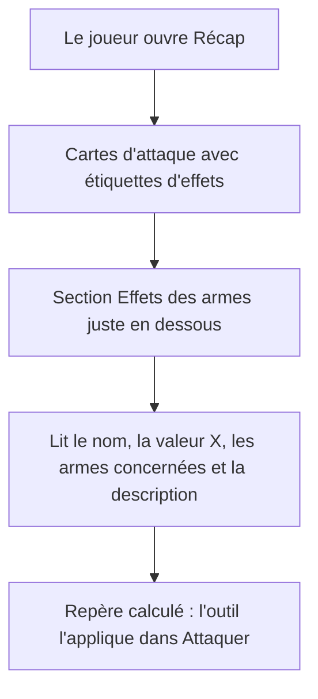
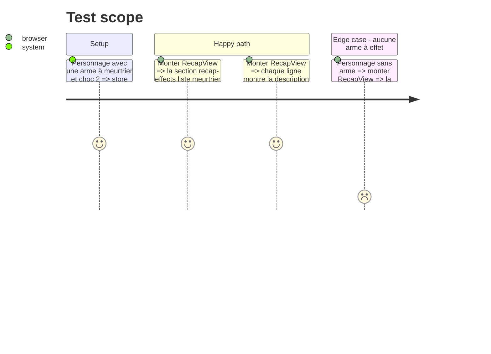

# Instruction: Section « Effets » sur la page Récap

## Architecture projection

> Tree of the final files. ✅ create · ✏️ modify · ❌ delete

```txt
.
├── src/components/RecapView.vue   ✏️ nouvelle section « Effets des armes » sous les attaques
├── src/styles/base.css            ✏️ styles du lexique (écran et impression)
└── tests/recap.spec.ts            ✏️ test d'affichage de la section
```

## User Journey



## Test Scope



## Wireframe

```txt
┌──────────────────────────────────────────────────────────────┐
│ (1) ⚔ Attaques : cartes existantes (étiquettes d'effets)      │
├──────────────────────────────────────────────────────────────┤
│ (2) 📖 Effets des armes                                       │
│  ┌──────────────────────────────────────────────────────────┐│
│  │ (3) choc 2      [calculé]   Marteau-épieu                 ││
│  │     Si les réussites dépassent la Chair…                  ││
│  ├──────────────────────────────────────────────────────────┤│
│  │ (3) meurtrier   [calculé]   Marteau-épieu · Fusil…        ││
│  │     +2D6 aux dégâts si les PS sont touchés.               ││
│  └──────────────────────────────────────────────────────────┘│
│ (4) Légende : « calculé » = appliqué par l'outil dans Attaquer │
├───────────────────────────────┬──────────────────────────────┤
│ Capacités et modules (existant)│ Caractéristiques (existant)  │
└───────────────────────────────┴──────────────────────────────┘
```

1. Attaques : inchangé, les infobulles des étiquettes restent.
2. Nouvelle section pleine largeur, masquée s'il n'y a aucun effet.
3. Une ligne par effet : libellé avec valeurs X, repère calculé, armes concernées, description.
4. Une ligne d'aide sur le sens du repère.

## Tasks to do

### `1)` Section dans `RecapView.vue`

> Afficher le lexique sous les attaques.

1. Calculer `effects = recapEffects(attacks, rulesStore.catalogs.effets)`.
2. Ajouter `<section class="recap-block" aria-labelledby="recap-effects">` avec `data-testid="recap-effects"`, `v-if="effects.length"`, entre Attaques et la première `recap-columns`.
3. Liste de définitions : libellé (valeurs X jointes par « / »), badge « calculé » si `calcule`, armes en texte discret, description.
4. Ligne d'aide (`.hint`) sur le badge « calculé ».

### `2)` Styles

> Lisible à l'écran, compact à l'impression.

1. Dans `src/styles/base.css`, styles `.recap-effects` cohérents avec `.recap-traits` et `.cap-effect` (tokens existants).
2. Deux colonnes sur grand écran, une seule sur écran étroit.
3. Dans `@media print`, éviter de couper une ligne d'effet entre deux pages (`break-inside: avoid`).

### `3)` Test d'affichage

> Vérifier la section dans le composant monté.

1. Dans `tests/recap.spec.ts` (bloc « page Récap »), monter avec une arme à effets et vérifier libellés et descriptions.
2. Vérifier l'absence de la section quand aucun effet n'est porté.

## Test acceptance criteria

| Task | Acceptance criteria |
| ---- | ------------------- |
| 1    | Sur la page Récap, chaque effet des armes du personnage apparaît une fois avec sa description lisible sans survol. |
| 1    | Les effets appliqués par l'outil portent le repère « calculé ». |
| 1    | Sans arme à effet, la section n'apparaît pas. |
| 2    | La section reste lisible en thème clair et sombre, sur écran étroit et à l'impression. |
| 3    | `npm test` et la vérification de types passent. |
